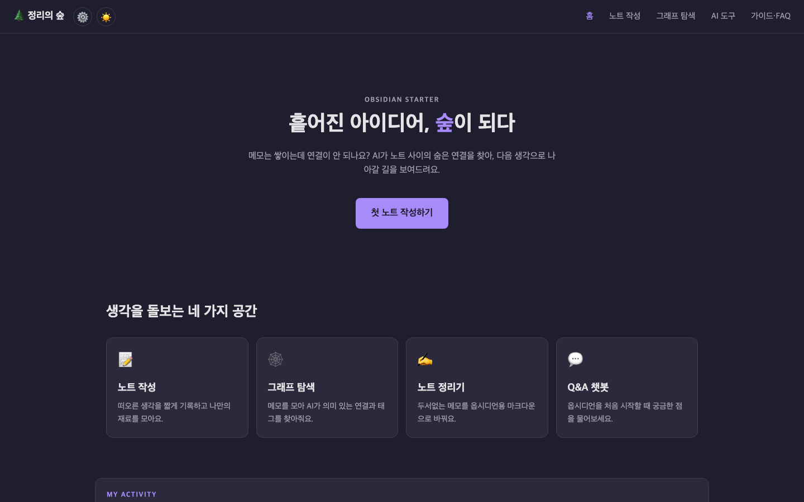
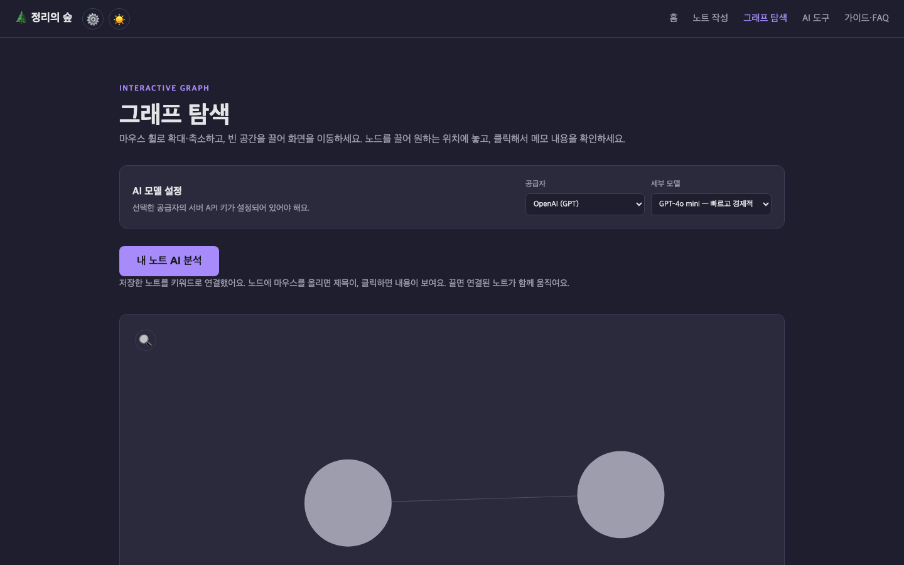
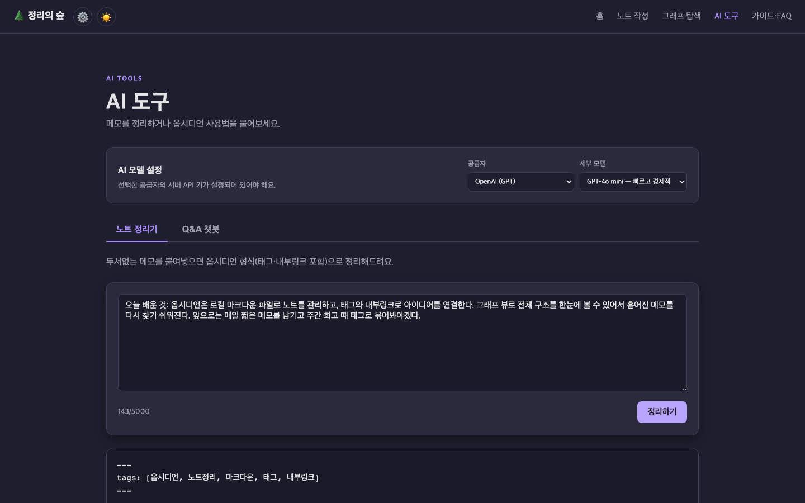
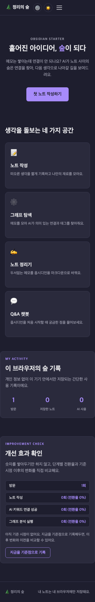

# 🌲 정리의 숲 

흩어진 메모를 적으면 AI가 아이디어 사이의 연결을 찾아 그래프로 보여주는 **옵시디언 입문 도우미** 웹 서비스.

**배포 URL**: https://obsidian-helper.vercel.app

## 주요 기능

- **아이디어 그래프**: 노트를 추가하면 저장된 노트끼리 AI가 뽑은 키워드로 자동 연결되고, "내 노트 AI 분석"으로 의미 기반 연결(이유 포함)을 더할 수 있어요. 결과는 옵시디언용 마크다운(`[[내부링크]]` 포함)으로 복사할 수 있어요.
  - **검색**: 그래프 캔버스 왼쪽 위 돋보기(🔍)를 누르면 입력창이 열리고, 입력하는 대로 제목·내용이 일치하는 노드만 밝아져요.
  - **편집**: 노드를 클릭해 연 SELECTED NOTE 패널의 톱니바퀴(⚙️)로 제목·내용·키워드를 바로 고칠 수 있어요. 저장하면 그래프가 새 키워드 기준으로 다시 연결돼요.
  - 그래프 빈 공간을 클릭하면 선택이 해제돼요.
- **노트 정리기**: 두서없는 메모를 frontmatter·태그·내부링크가 포함된 옵시디언 노트로 정리해줘요. "그래프에 저장" 버튼으로 정리된 결과를 바로 아이디어 그래프에 노트로 추가할 수 있어요.
- **Q&A 챗봇**: 옵시디언에 대한 질문에 답하는 전문가 챗봇.
- **가이드·FAQ**: Vault, 노트, 태그, 내부링크, 그래프 뷰 핵심 개념 안내.

## 기술 스택

- 프론트엔드: 순수 HTML/CSS/JavaScript (프레임워크·빌드 도구 없음)
- 백엔드: Vercel Serverless Functions (Python) + OpenAI·Claude·Gemini API
- 저장: 노트는 브라우저 localStorage에만 저장 (서버 저장 없음)

## 로컬 실행

```bash
npm i -g vercel        # 최초 1회
vercel env pull        # .env.local 생성 (OPENAI_API_KEY)
vercel dev
```

## 배포 (Vercel)

1. GitHub 저장소를 Vercel에 연결 (또는 `vercel link`)
2. **Settings → Environment Variables**에 `OPENAI_API_KEY` 등록 (Notion·Discord 연동을 서버 기본값으로도 쓰려면 아래 표의 변수도 함께)
3. `vercel --prod`로 배포 후 배포 URL에서 연결 분석·정리기·챗봇 동작 확인
4. **Framework Preset은 반드시 "Other"**로 두세요. "Python"으로 설정되면 `api/`의 여러 서버리스 함수를 하나의 Python 앱 진입점으로 오인해 빌드가 실패합니다.

> ⚠️ API 키는 환경 변수로만 관리해요. `.env*` 파일은 절대 커밋하지 마세요 (`.gitignore`에 포함됨).

### AI 공급자별 환경 변수

웹 화면에서 공급자와 모델을 선택할 수 있어요. 실제 호출에는 선택한 공급자의 키만 필요합니다.

| 공급자 | 환경 변수 | 선택 가능 모델 |
| --- | --- | --- |
| OpenAI | `OPENAI_API_KEY` | GPT-4o mini, GPT-4.1 mini |
| Anthropic | `ANTHROPIC_API_KEY` | Claude Haiku 4.5, Sonnet 4.6, Opus 4.8 |
| Google | `GEMINI_API_KEY` | Gemini 3.5 Flash, Gemini 3 Pro |

Vercel에서는 **Settings → Environment Variables**에 필요한 키를 등록한 뒤 재배포하세요.

### 운영 자동화 연동 (선택)

노트를 저장하면 백그라운드로 Notion 데이터베이스에 기록하고 Discord로 알림을 보내요. 둘 다 선택 사항이며, 설정이 없으면 조용히 건너뛰어요(노트 저장 자체는 항상 정상 동작). 실패해도 다른 한쪽은 계속 시도하고, 항상 200으로 응답하면서 결과만 항목별로 알려줘요.

설정하는 방법은 두 가지예요.

1. **화면에서 직접 설정 (권장, 배포 없이 바로 사용 가능)**: 헤더의 ⚙️(연동 설정) 버튼 → Discord Webhook URL / Notion Integration Token / Notion Database ID 입력 → 저장. 이 값은 **이 브라우저의 localStorage에만** 저장되고, 노트를 저장할 때만 서버로 함께 전달돼요.
2. **서버 환경 변수로 설정**: 아래 표의 환경 변수를 등록하면 화면에서 따로 설정하지 않아도 기본값으로 동작해요. (화면에서 입력한 값이 있으면 그게 우선합니다.)

| 환경 변수 | 용도 | 준비 방법 |
| --- | --- | --- |
| `NOTION_TOKEN` | Notion API 인증 | Notion → Settings → Connections에서 **internal integration** 생성 후 토큰 발급, 대상 데이터베이스에 그 연결을 공유 |
| `NOTION_DATABASE_ID` | 저장할 데이터베이스 | 데이터베이스에 **제목**(Title 타입), **키워드**(Text 타입), **내용**(Text 타입) 속성이 있어야 함. 데이터베이스 URL의 32자리 ID 부분 |
| `DISCORD_WEBHOOK_URL` | Discord 알림 | Discord 채널 설정 → 연동 → 웹후크 → 새 웹후크 만들기 → URL 복사 |

> Discord Webhook URL은 서버가 그대로 요청을 대신 보내주는 값이라, `discord.com` 계열 호스트가 아니면 서버에서 거부해요(임의 URL로 요청을 대신 보내는 SSRF 방지).

## 개선 효과 확인 (보너스)

홈 화면의 "개선 효과 확인" 섹션에서 단순 누적 수치를 넘어 두 가지를 함께 보여줘요.

- **사용 퍼널**: 방문 → 노트 작성 → AI 키워드 연결 성공 → 그래프 분석 실행의 단계별 전환율.
- **기준 시점 비교**: "지금을 기준점으로 기록" 버튼을 누르면 그 시점을 저장해두고, 이후 노트/AI 성공/그래프 분석이 얼마나 늘었는지 비교해 보여줘요. 예를 들어 AI 프롬프트를 바꾼 뒤 기준점을 새로 찍으면, 그 변경이 실제로 성공률에 영향을 줬는지 확인할 수 있어요.

내부적으로는 `forest_events`(타임스탬프가 있는 이벤트 로그)와 `forest_snapshot`(기준 시점)을 localStorage에 저장해서 계산해요 — 여기도 외부로는 전송되지 않아요.

## 폴더 구조

```
obsidian-helper/
├── index.html          # 홈
├── notes.html          # 노트 작성
├── workspace.html      # 인터랙티브 그래프 탐색
├── tools.html          # AI 노트 정리기 · Q&A 챗봇
├── guide.html          # 옵시디언 가이드 · FAQ
├── css/style.css       # 다크 테마 + 반응형
├── js/
│   ├── common.js       # 공통 메뉴, 테마, 활동 통계, 이벤트 로그·퍼널·기준시점 비교
│   ├── main.js         # 노트 작성, 탭, fetch 헬퍼, AI 기능 연결, 백그라운드 동기화
│   ├── notes.js        # 노트 CRUD + localStorage
│   ├── graph.js        # 드래그·호버·클릭 가능한 canvas 그래프
│   └── graph-page.js   # 그래프 분석·검색·SELECTED NOTE 편집 페이지 로직
├── api/
│   ├── connect.py      # 아이디어 연결 분석 (OpenAI·Anthropic·Google 공용 어댑터 포함)
│   ├── organize.py     # 노트 정리기 (〃)
│   ├── chat.py         # Q&A 챗봇 (〃)
│   ├── keywords.py     # 노트 저장 시 키워드 3개 추출 (1번째는 분야 카테고리, 기존 카테고리 우선 재사용, 〃)
│   └── sync.py         # 노트를 Notion에 저장·Discord로 알림 (선택)
├── requirements.txt
└── vercel.json
```

> `connect.py`·`organize.py`·`chat.py`·`keywords.py`는 각각 AI 공급자 어댑터 코드를 그대로 포함하고 있어요(공용 모듈로 분리하지 않음). Vercel의 Python 빌더가 `api/` 안의 형제 파일을 함수마다 항상 함께 번들링해주지는 않아서(실배포에서 `ModuleNotFoundError` 확인), 각 서버리스 함수를 독립적으로 완결되게 만들었습니다.

## 보너스 기능

과제의 두 보너스 카테고리를 모두 구현했어요.

**1. 운영 자동화 / 데이터 저장 고도화**
- 노트 저장 시 Notion 데이터베이스에 기록하고 Discord로 알림을 보내요. 화면의 ⚙️ 설정 또는 서버 환경 변수로 구성할 수 있어요 (위 [운영 자동화 연동](#운영-자동화-연동-선택) 참고).

**2. UX 및 측정 고도화**
- 다크/라이트 테마 전환: 선택한 테마를 브라우저에 저장해 다음 방문에도 유지해요.
- 마이크로 인터랙션: 버튼·카드 hover, AI 로딩 표시, 복사 완료 피드백, 그래프 노드 hover·클릭·드래그 반응을 제공해요.
- 그래프 검색·편집: 노트를 찾고, 그 자리에서 고쳐 다시 연결할 수 있어요 (위 [아이디어 그래프](#주요-기능) 참고).
- 간단한 사용 통계: 방문 수, 저장한 노트 수, AI 사용 수를 이 브라우저의 localStorage에만 저장해 보여줘요. 외부 분석 도구로 전송하지 않아요.
- **개선 효과 확인**: 단순 집계를 넘어 퍼널 전환율과 기준 시점 대비 변화를 보여줘요 — "개선 효과를 확인하는 방법"까지 설계한 부분이에요 (위 [개선 효과 확인](#개선-효과-확인-보너스) 참고).

## 서비스 기획서

서비스 목적, 타겟 사용자, 페이지 구성, AI 기능의 입력·출력·실패 처리 기준은 [SERVICE_PLAN.md](SERVICE_PLAN.md)에서 확인할 수 있어요.

## 스크린샷 · AI 코딩 도구 사용 로그

배포된 URL에서 직접 찍은 데스크톱·모바일·AI 기능 동작 스크린샷은 [docs/screenshots](docs/screenshots)에, AI 코딩 도구(Claude Code)로 개발하며 실제로 겪은 트러블슈팅 과정은 [docs/ai-tool-usage-log.md](docs/ai-tool-usage-log.md)에 정리해뒀어요.

|  |  |
| --- | --- |
|  |  |
|  |  |
